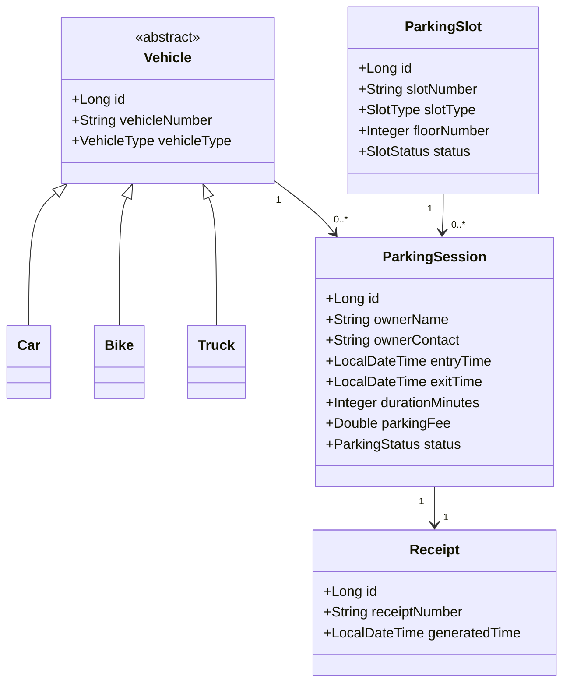

# Class Diagram

# Smart Parking Lot Management System

---

## Document Information

| Field | Value |
|-------|-------|
| Document Name | Class Diagram |
| Version | 1.0 |
| Project | Smart Parking Lot Management System |
| Diagram Type | UML Class Diagram |
| Prepared By | Gaurav Kumar Singh |

---

# Table of Contents

1. Introduction
2. Purpose
3. Design Overview
4. UML Class Diagram
5. Class Responsibilities
6. Relationships
7. OOP Principles
8. Design Decisions
9. Future Expansion
10. Conclusion

---

# 1. Introduction

The Class Diagram represents the static structure of the Smart Parking Lot Management System.

It illustrates:

- Classes
- Attributes
- Methods
- Relationships
- Inheritance
- Associations
- Dependencies

Unlike the Entity Relationship Diagram, the Class Diagram models the application's object-oriented design rather than the database schema.

---

# 2. Purpose

The Class Diagram provides developers with a blueprint of the application's domain model.

It defines:

- Business objects
- Relationships
- Responsibilities
- Object interactions

This document serves as the foundation for implementing the backend using Java and Spring Boot.

---

# 3. Design Overview

The system consists of the following primary classes:

- Vehicle (Abstract)
- Car
- Bike
- Truck
- ParkingSlot
- ParkingSession
- Receipt

Supporting service classes include:

- VehicleService
- ParkingService
- SlotService
- DashboardService
- ReportService

---

# 4. UML Class Diagram

---

# 5. Class Responsibilities

## Vehicle

Responsibilities

- Store vehicle information
- Represent a registered vehicle
- Provide common behavior for all vehicle types

Parent Class

---

## Car

Represents a four-wheeler.

Inherits all common properties from Vehicle.

---

## Bike

Represents a two-wheeler.

Inherits all common properties from Vehicle.

---

## Truck

Represents a heavy vehicle.

Inherits all common properties from Vehicle.

---

## ParkingSlot

Responsibilities

- Represent a parking location
- Store slot status
- Store slot type
- Store floor information

---

## ParkingSession

Responsibilities

- Store parking lifecycle
- Connect Vehicle and ParkingSlot
- Calculate parking duration
- Store parking fee

This is the central business entity.

---

## Receipt

Responsibilities

- Generate payment proof
- Store receipt details
- Reference completed parking session

---

# 6. Relationships

## Inheritance

Vehicle

↓

Car

Bike

Truck

---

## Association

Vehicle

1

↓

*

ParkingSession

---

ParkingSlot

1

↓

*

ParkingSession

---

ParkingSession

1

↓

1

Receipt

---

# 7. OOP Principles

The class design demonstrates the following Object-Oriented Programming principles.

## Abstraction

Vehicle is an abstract class.

Concrete implementations

- Car
- Bike
- Truck

---

## Inheritance

Vehicle acts as the base class.

All vehicle types inherit common behavior.

---

## Encapsulation

All attributes remain private.

Access is provided through getters and setters.

---

## Polymorphism

Parking services interact with the Vehicle abstraction instead of concrete subclasses.

---

# 8. Design Decisions

## Abstract Vehicle

Using an abstract Vehicle class avoids code duplication and enables future vehicle types.

---

## ParkingSession

ParkingSession connects Vehicle and ParkingSlot.

Advantages

- Preserves history
- Simplifies reporting
- Supports future billing

---

## Receipt

Receipt is separated from ParkingSession to maintain clear business responsibilities.

---

# 9. Future Expansion

The class hierarchy supports future additions.

Examples

Vehicle

↓

ElectricCar

Bus

EmergencyVehicle

VIPVehicle

No major redesign is required.

---

# 10. Conclusion

The Class Diagram defines the application's domain model and object relationships.

It demonstrates proper object-oriented design through abstraction, inheritance, encapsulation, and polymorphism while keeping the model extensible and maintainable.

---
**End of Class Diagram Document**