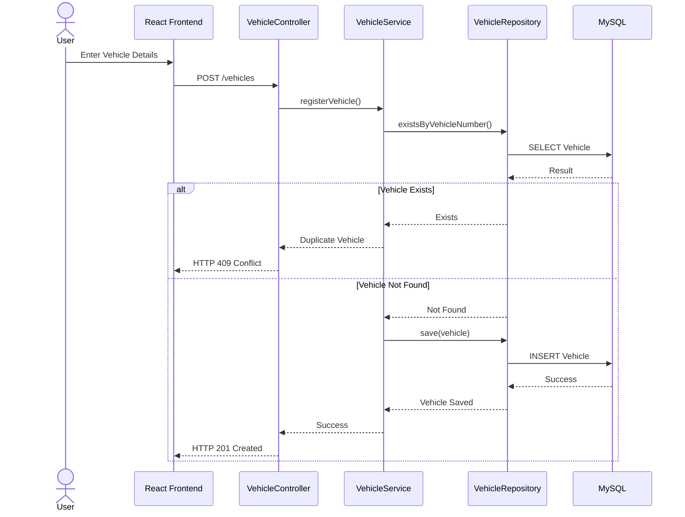
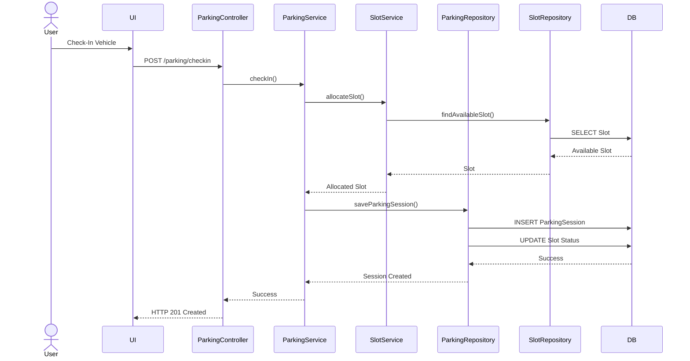
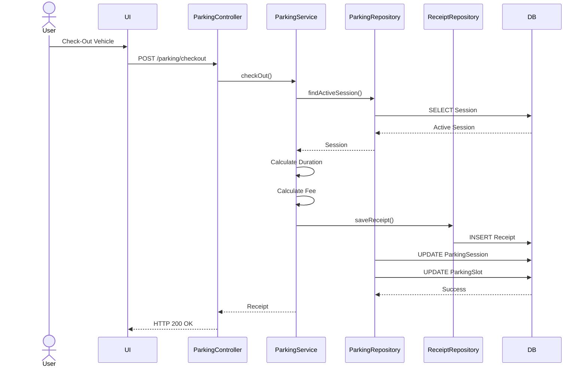
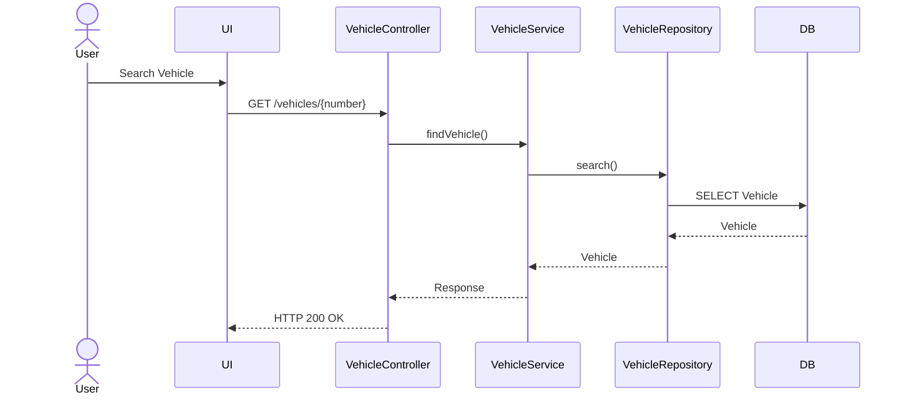
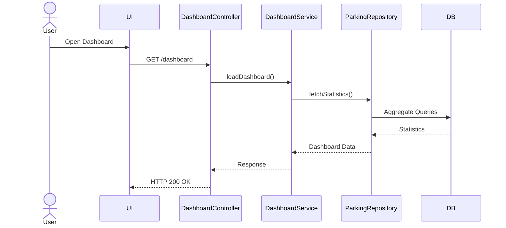
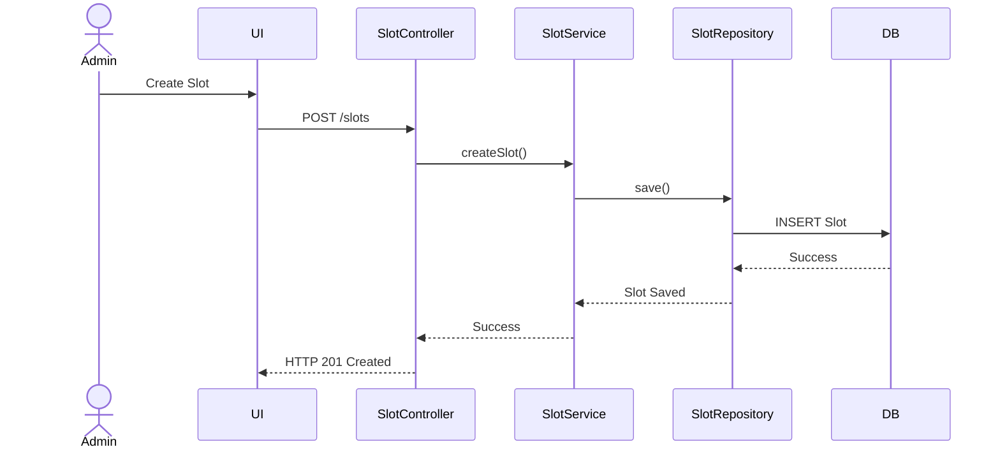
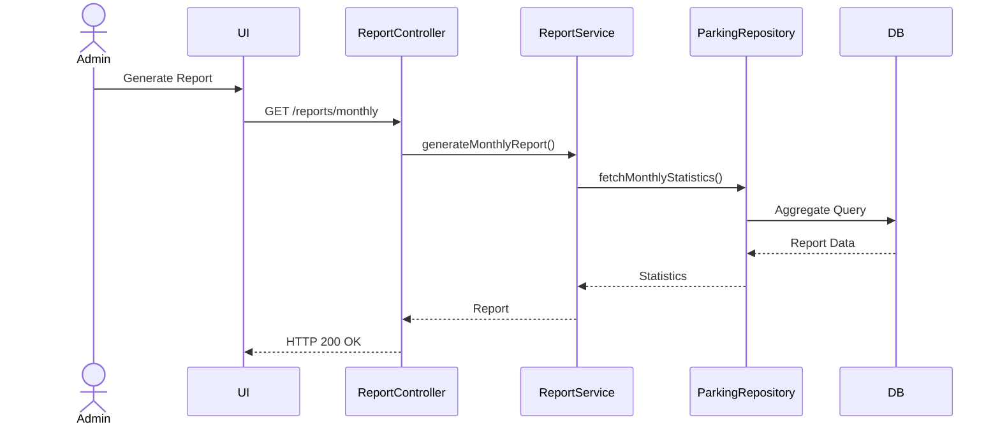

# Sequence Diagrams

# Smart Parking Lot Management System

---

## Document Information

| Field | Value |
|-------|-------|
| Document Name | Sequence Diagrams |
| Version | 1.0 |
| Project | Smart Parking Lot Management System |
| Diagram Type | UML Sequence Diagram |
| Prepared By | Gaurav Kumar Singh |
| Last Updated | July 2026 |

---

# Table of Contents

1. Introduction
2. Purpose
3. Participants
4. Vehicle Registration
5. Vehicle Check-In
6. Vehicle Check-Out
7. Search Vehicle
8. Dashboard Loading
9. Slot Management
10. Report Generation
11. Design Considerations
12. Conclusion

---

# 1. Introduction

Sequence diagrams describe the runtime behavior of the Smart Parking Lot Management System.

Unlike the Class Diagram, which illustrates the static structure of the application, Sequence Diagrams illustrate how objects collaborate over time to complete a business operation.

Each diagram represents a specific use case and the interactions between system components.

---

# 2. Purpose

The objectives of the Sequence Diagrams are to:

- Visualize request processing.
- Describe communication between layers.
- Define execution order.
- Validate business workflows.
- Assist backend implementation.
- Simplify debugging and maintenance.

---

# 3. Participants

The following participants appear throughout the sequence diagrams.

| Participant | Responsibility |
|-------------|----------------|
| User | Initiates operations |
| React Frontend | Sends HTTP requests |
| Controller | Handles REST endpoints |
| Service | Executes business logic |
| Repository | Performs database operations |
| MySQL Database | Stores persistent data |

---

# 4. Vehicle Registration

## Description

Registers a new vehicle in the system.

### Sequence Diagram

---

# 5. Vehicle Check-In

## Description

Creates an active parking session for a vehicle.

### Sequence Diagram

---

# 6. Vehicle Check-Out

## Description

Completes a parking session and releases the occupied slot.

### Sequence Diagram

---

# 7. Search Vehicle

## Description

Searches a registered vehicle.

### Sequence Diagram

---

# 8. Dashboard Loading

## Description

Loads dashboard statistics.

### Sequence Diagram

---

# 9. Parking Slot Management

## Description

Creates a new parking slot.

### Sequence Diagram

---

# 10. Report Generation

## Description

Generates a monthly parking report.

### Sequence Diagram

---

# 11. Design Considerations

The sequence diagrams follow these design principles:

- Controllers only coordinate requests.
- Services contain all business logic.
- Repositories handle data access only.
- The database is accessed exclusively through repositories.
- Each business operation follows a layered execution flow.
- Transactions are managed within the Service Layer.

---

# 12. Conclusion

The Sequence Diagrams define the dynamic behavior of the Smart Parking Lot Management System by illustrating how components interact during major business operations.

These diagrams validate the runtime execution flow and provide implementation guidance for backend development while ensuring clear separation of responsibilities across application layers.

---
**End of Sequence Diagrams Document**