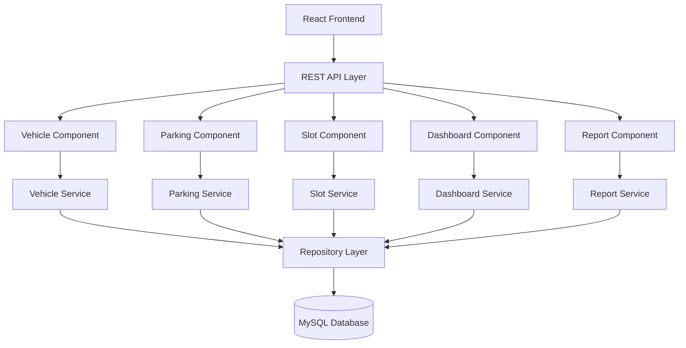

# Component Diagram

# Smart Parking Lot Management System

---

## Document Information

| Field | Value |
|-------|-------|
| Document Name | Component Diagram |
| Version | 1.0 |
| Project | Smart Parking Lot Management System |
| Diagram Type | UML Component Diagram |
| Prepared By | Gaurav Kumar Singh |
| Last Updated | July 2026 |

---

# Table of Contents

1. Introduction
2. Purpose
3. Component Overview
4. Component Diagram
5. Component Description
6. Component Interactions
7. Dependency Analysis
8. Cross-Cutting Components
9. Design Principles
10. Future Expansion
11. Conclusion

---

# 1. Introduction

The Component Diagram illustrates the high-level organization of the Smart Parking Lot Management System by dividing the application into independent software components.

Each component represents a logical unit responsible for a specific set of functionalities.

Unlike the Class Diagram, which focuses on individual classes, the Component Diagram emphasizes subsystem organization and dependencies.

---

# 2. Purpose

The objectives of the Component Diagram are:

- Visualize software modules
- Show dependencies
- Improve maintainability
- Simplify development
- Support modular architecture
- Assist future scaling

---

# 3. Component Overview

The system consists of the following major components.

### Frontend

- React Application
- Dashboard
- Forms
- Reports
- Search

---

### Backend

- REST API
- Business Services
- Persistence Layer

---

### Database

- MySQL Database

---

# 4. UML Component Diagram



---

# 5. Component Description

## 5.1 React Frontend

### Responsibilities

- User Interface
- Form Submission
- Dashboard Visualization
- Report Display
- Search Interface

### Technologies

- React
- Vite
- Tailwind CSS
- Axios

---

## 5.2 REST API Layer

### Responsibilities

- Receive HTTP Requests
- Route Requests
- Validate Input
- Return JSON Responses

### Technologies

- Spring MVC
- REST Controllers

---

## 5.3 Vehicle Component

### Responsibilities

- Vehicle Registration
- Vehicle Search
- Vehicle Details
- Vehicle History

Depends On

- Vehicle Service

---

## 5.4 Parking Component

### Responsibilities

- Vehicle Check-In
- Vehicle Check-Out
- Fee Calculation
- Parking Session Management

Depends On

- Parking Service
- Slot Component

---

## 5.5 Slot Component

### Responsibilities

- Slot Allocation
- Slot Release
- Slot Management

Depends On

- Slot Service

---

## 5.6 Dashboard Component

### Responsibilities

- Occupancy Statistics
- Revenue Summary
- Active Sessions
- Recent Activity

Depends On

- Dashboard Service

---

## 5.7 Report Component

### Responsibilities

- Daily Reports
- Weekly Reports
- Monthly Reports
- Revenue Reports

Depends On

- Report Service

---

## 5.8 Repository Layer

### Responsibilities

- CRUD Operations
- Custom Queries
- Database Access

Repositories

- VehicleRepository
- ParkingRepository
- SlotRepository
- ReceiptRepository

---

## 5.9 MySQL Database

### Responsibilities

- Persistent Storage
- Referential Integrity
- Transaction Support

---

# 6. Component Interactions

## Vehicle Registration

```
React

↓

Vehicle Controller

↓

Vehicle Service

↓

Vehicle Repository

↓

MySQL
```

---

## Vehicle Check-In

```
React

↓

Parking Controller

↓

Parking Service

↓

Slot Service

↓

Repositories

↓

Database
```

---

## Dashboard Loading

```
Dashboard

↓

Dashboard Controller

↓

Dashboard Service

↓

Repositories

↓

Database
```

---

# 7. Dependency Analysis

| Component | Depends On |
|------------|------------|
| Vehicle | Vehicle Service |
| Parking | Parking Service, Slot Service |
| Slot | Slot Service |
| Dashboard | Dashboard Service |
| Reports | Report Service |
| Services | Repository Layer |
| Repository | Database |

Dependencies flow in one direction only.

This minimizes coupling between modules.

---

# 8. Cross-Cutting Components

The following components are shared across multiple modules.

### Validation

- Bean Validation
- Request Validation

---

### Exception Handling

- Global Exception Handler
- Custom Exceptions

---

### Logging

- SLF4J
- Logback

---

### Configuration

- Spring Configuration
- Application Properties

---

### DTO Mapper

- Entity to DTO
- DTO to Entity

---

# 9. Design Principles

The component architecture follows:

- Separation of Concerns
- Single Responsibility Principle
- Dependency Injection
- High Cohesion
- Low Coupling
- Modular Design
- Reusability
- Maintainability

---

# 10. Future Expansion

The architecture supports adding new components.

Examples

- Authentication Component
- Payment Component
- Reservation Component
- Notification Component
- Analytics Component
- Audit Component

Each new component can integrate without major modifications to existing modules.

---

# 11. Conclusion

The Component Diagram presents the Smart Parking Lot Management System as a collection of loosely coupled, highly cohesive components.

This modular organization improves maintainability, simplifies testing, supports future enhancements, and aligns with enterprise software engineering practices.

---
**End of Component Diagram Document**