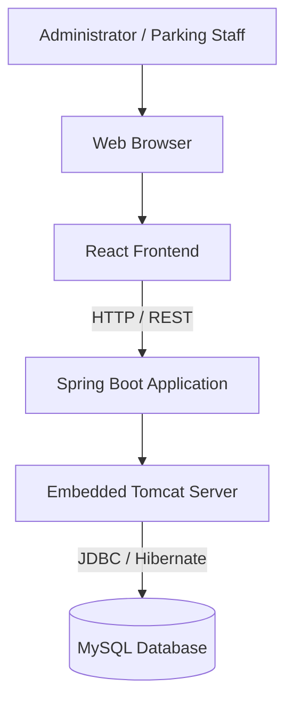

# Deployment Diagram

# Smart Parking Lot Management System

---

## Document Information

| Field | Value |
|-------|-------|
| Document Name | Deployment Diagram |
| Version | 1.0 |
| Project | Smart Parking Lot Management System |
| Diagram Type | UML Deployment Diagram |
| Prepared By | Gaurav Kumar Singh |
| Last Updated | July 2026 |

---

# Table of Contents

1. Introduction
2. Purpose
3. Deployment Overview
4. Runtime Environment
5. Deployment Diagram
6. Node Description
7. Communication Flow
8. Deployment Process
9. Environment Configuration
10. Scalability Considerations
11. Future Deployment
12. Conclusion

---

# 1. Introduction

The Deployment Diagram illustrates the physical deployment architecture of the Smart Parking Lot Management System.

Unlike the Component Diagram, which describes software modules, the Deployment Diagram focuses on where and how the application is deployed during runtime.

It identifies the physical nodes, deployed artifacts, communication channels, and runtime environments.

---

# 2. Purpose

The objectives of the Deployment Diagram are:

- Describe physical deployment.
- Define runtime nodes.
- Illustrate communication between nodes.
- Explain deployment topology.
- Support future cloud deployment.
- Simplify DevOps planning.

---

# 3. Deployment Overview

The Smart Parking Lot Management System follows a three-tier deployment architecture.

The application consists of:

- Client Layer
- Application Layer
- Database Layer

Each layer executes on an independent runtime environment.

---

# 4. Runtime Environment

## Client Layer

Responsibilities

- Display user interface
- Send HTTP requests
- Render dashboard
- Display reports

Technology

- React
- Vite
- HTML5
- CSS3
- JavaScript

Runtime

Modern Web Browser

---

## Application Layer

Responsibilities

- REST API
- Business Logic
- Validation
- Transaction Management

Technology

- Java 21
- Spring Boot
- Spring MVC
- Hibernate
- Spring Data JPA

Runtime

Embedded Apache Tomcat

---

## Database Layer

Responsibilities

- Persistent Storage
- Query Processing
- Transactions
- Data Integrity

Technology

- MySQL 8.x

---

# 5. Deployment Diagram



---

# 6. Node Description

## Node 1

### Client Machine

Artifacts

- React Application
- HTML
- CSS
- JavaScript

Responsibilities

- User Interaction
- API Communication

---

## Node 2

### Application Server

Artifacts

- Spring Boot JAR
- Controllers
- Services
- Repositories
- Configuration Files

Responsibilities

- Business Logic
- REST APIs
- Validation
- Exception Handling

---

## Node 3

### Database Server

Artifacts

- MySQL Database

Responsibilities

- Store Persistent Data
- Execute SQL Queries
- Maintain Relationships

---

# 7. Communication Flow

```
User

↓

Browser

↓

React Frontend

↓

HTTP Request

↓

Spring Boot

↓

Hibernate

↓

MySQL

↓

Hibernate

↓

Spring Boot

↓

JSON Response

↓

React UI
```

---

# 8. Deployment Process

### Step 1

Build React Frontend

Output

```
dist/
```

---

### Step 2

Build Spring Boot Application

Output

```
smart-parking-system.jar
```

---

### Step 3

Start MySQL Server

---

### Step 4

Run Spring Boot Application

```
java -jar smart-parking-system.jar
```

---

### Step 5

Open Browser

```
http://localhost:5173
```

React communicates with

```
http://localhost:8080/api/v1
```

---

# 9. Environment Configuration

## Development Environment

Frontend

```
localhost:5173
```

Backend

```
localhost:8080
```

Database

```
localhost:3306
```

---

## Production Environment

Frontend

```
https://parking.example.com
```

Backend

```
https://api.parking.example.com
```

Database

```
MySQL Production Server
```

---

# 10. Scalability Considerations

The deployment architecture supports future improvements.

Examples

- Docker Containers
- Nginx Reverse Proxy
- Load Balancer
- Cloud Hosting
- Kubernetes
- Database Replication

No architectural redesign is required.

---

# 11. Future Deployment

Future production deployment may include:

```text
Users

↓

Cloudflare CDN

↓

Nginx Reverse Proxy

↓

Load Balancer

↓

Spring Boot Instance 1

Spring Boot Instance 2

↓

MySQL Cluster

↓

Backup Server
```

Possible cloud providers

- AWS
- Azure
- Google Cloud Platform

---

# 12. Deployment Requirements

## Minimum Hardware

Application Server

- CPU: 2 Cores
- RAM: 4 GB
- Storage: 20 GB

Database Server

- CPU: 2 Cores
- RAM: 4 GB
- SSD Storage

Client

- Modern Browser
- Internet Connection

---

# 13. Deployment Checklist

Before deployment ensure:

- Java 21 installed
- MySQL running
- Database schema created
- Environment variables configured
- Backend builds successfully
- Frontend builds successfully
- API endpoints tested
- CORS configured
- Database connectivity verified

---

# 14. Security During Deployment

Recommended practices:

- Use HTTPS in production.
- Store secrets in environment variables.
- Restrict database access.
- Enable firewall rules.
- Regular database backups.
- Monitor application logs.
- Use secure database credentials.

---

# 15. Conclusion

The Deployment Diagram defines the runtime architecture of the Smart Parking Lot Management System.

The application follows a three-tier deployment model consisting of the client, application server, and database server. This deployment strategy provides a clean separation of responsibilities, simplifies maintenance, and supports future migration to cloud-native environments without requiring significant architectural changes.

---
**End of Deployment Diagram Document**