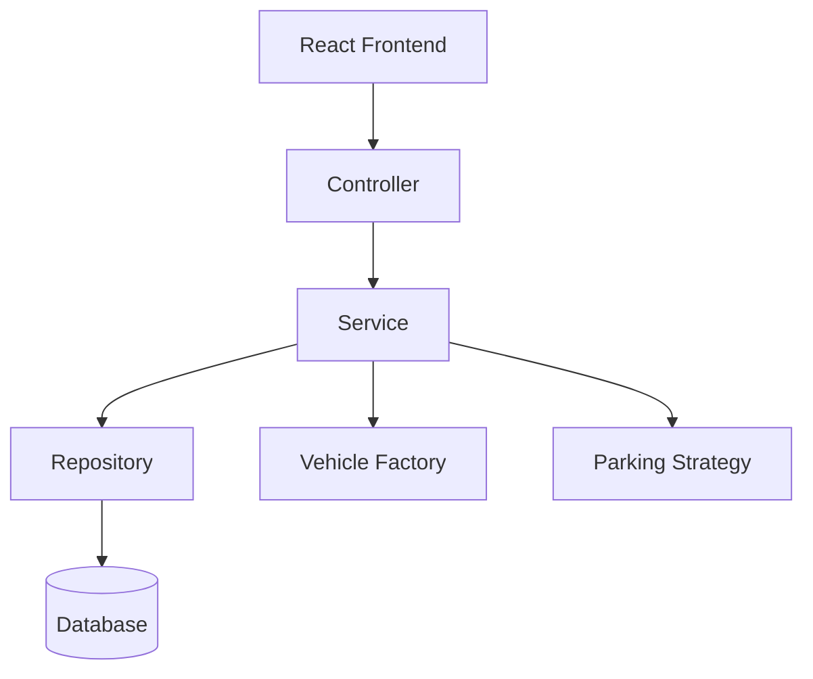

# Design Patterns

# Smart Parking Lot Management System

---

## Document Information

| Field | Value |
|-------|-------|
| Document Name | Design Patterns |
| Version | 1.0 |
| Project | Smart Parking Lot Management System |
| Prepared By | Gaurav Kumar Singh |
| Last Updated | July 2026 |

---

# Table of Contents

1. Introduction
2. Why Design Patterns?
3. Architectural Patterns
4. Creational Patterns
5. Structural Patterns
6. Behavioral Patterns
7. Spring Framework Patterns
8. Pattern Interaction
9. Benefits
10. Future Improvements
11. Conclusion

---

# 1. Introduction

Design Patterns are reusable solutions to common software design problems.

Instead of reinventing solutions for object creation, communication, and organization, this project adopts proven design patterns to improve maintainability, readability, extensibility, and scalability.

The Smart Parking Lot Management System combines Object-Oriented Programming principles with modern Spring Boot design patterns to create a clean and modular architecture.

---

# 2. Why Design Patterns?

The project uses design patterns to achieve the following goals:

- Reduce code duplication
- Improve maintainability
- Increase modularity
- Promote loose coupling
- Improve extensibility
- Simplify testing
- Follow enterprise software development practices

---

# 3. Architectural Patterns

## 3.1 Layered Architecture

### Purpose

Separates the application into logical layers.

### Layers

```
Presentation Layer

↓

Controller Layer

↓

Service Layer

↓

Repository Layer

↓

Database Layer
```

### Benefits

- Easy to maintain
- Clear responsibilities
- Better separation of concerns
- Easier debugging

---

## 3.2 MVC (Model-View-Controller)

### Purpose

Separates presentation logic from business logic.

### Components

Model

- Entities
- DTOs

View

- React Frontend

Controller

- Spring REST Controllers

### Flow

```
Client

↓

Controller

↓

Service

↓

Repository

↓

Database
```

### Benefits

- Cleaner architecture
- Easy frontend/backend separation
- Independent development

---

# 4. Creational Patterns

---

## 4.1 Factory Pattern

### Purpose

Creates appropriate Vehicle objects.

Instead of directly creating subclasses,

```
new Car()

new Bike()

new Truck()
```

a factory centralizes object creation.

### Example

```
VehicleFactory

↓

createVehicle(type)
```

Returns

- Car
- Bike
- Truck

### Benefits

- Centralized creation
- Easier extension
- Cleaner business logic

---

## 4.2 Singleton Pattern

### Purpose

Ensures only one instance exists.

### Used By Spring

Spring Beans

Examples

- VehicleService
- ParkingService
- SlotService

Each service is automatically managed as a Singleton by the Spring IoC Container.

### Benefits

- Reduced memory usage
- Shared business services
- Framework-managed lifecycle

---

# 5. Structural Patterns

---

## 5.1 Repository Pattern

### Purpose

Separates database logic from business logic.

### Example

```
ParkingService

↓

ParkingRepository

↓

MySQL
```

### Benefits

- Easier testing
- Database abstraction
- Cleaner services

---

## 5.2 DTO Pattern

### Purpose

Separates API models from database entities.

Instead of returning Entity objects directly,

Controllers return DTOs.

### Example

```
Vehicle Entity

↓

VehicleResponse DTO
```

### Benefits

- Secure APIs
- Stable contracts
- Flexible responses

---

# 6. Behavioral Patterns

---

## 6.1 Strategy Pattern

### Purpose

Supports different parking allocation algorithms.

### Current Strategy

```
FirstAvailableStrategy
```

### Future Strategies

- Nearest Entrance
- VIP Allocation
- Reserved Parking
- Electric Vehicle Priority

### Structure

```
ParkingStrategy

↓

FirstAvailableStrategy

NearestStrategy

VIPStrategy
```

### Benefits

- Open for extension
- No changes to ParkingService
- Flexible implementation

---

## 6.2 Dependency Injection

### Purpose

Removes manual object creation.

Instead of

```
new ParkingRepository()
```

Spring injects dependencies automatically.

### Example

```
ParkingService

↓

@Autowired

ParkingRepository
```

### Benefits

- Loose coupling
- Easier testing
- Better maintainability

---

# 7. Spring Framework Patterns

Spring Boot internally applies several enterprise patterns.

---

## IoC (Inversion of Control)

Spring manages object creation and lifecycle.

Developers focus on business logic.

---

## Bean Management

Services, Controllers, and Repositories are Spring-managed Beans.

---

## Proxy Pattern

Spring creates proxies for:

- Transactions
- AOP
- Security

Developers use these features without manual implementation.

---

## Template Pattern

Spring Data JPA provides reusable database operations.

Examples

```
save()

findAll()

findById()

delete()
```

without requiring manual SQL.

---

# 8. Pattern Interaction

The following diagram shows how patterns work together.



---

# 9. Pattern Summary

| Pattern | Purpose | Location |
|----------|---------|----------|
| Layered Architecture | Organize application | Entire Project |
| MVC | Separate UI and backend | Spring Boot |
| Repository | Database abstraction | Repository Layer |
| DTO | API communication | Controller Layer |
| Factory | Vehicle creation | Vehicle Module |
| Strategy | Slot allocation | Parking Module |
| Dependency Injection | Object management | Spring Framework |
| Singleton | Shared services | Spring Beans |
| IoC | Lifecycle management | Spring Container |
| Template | Database operations | Spring Data JPA |

---

# 10. Benefits

The selected patterns provide:

- Modular architecture
- Loose coupling
- High cohesion
- Easier testing
- Better scalability
- Code reusability
- Enterprise-level design
- Improved maintainability

---

# 11. Future Improvements

The architecture can support additional patterns.

Examples

- Observer Pattern (Notifications)
- Builder Pattern (Complex DTO creation)
- Command Pattern (Parking operations)
- State Pattern (Parking Session lifecycle)
- Adapter Pattern (Third-party payment gateway)
- Facade Pattern (Dashboard aggregation)

These patterns can be integrated without affecting the existing architecture.

---

# 12. Conclusion

The Smart Parking Lot Management System combines proven software design patterns with Spring Boot's built-in architectural features to create a clean, maintainable, and extensible application.

By leveraging Layered Architecture, MVC, Repository, DTO, Strategy, Factory, Dependency Injection, and Spring-managed patterns, the project follows enterprise software engineering practices while remaining easy to understand and extend.

---
**End of Design Patterns Document**